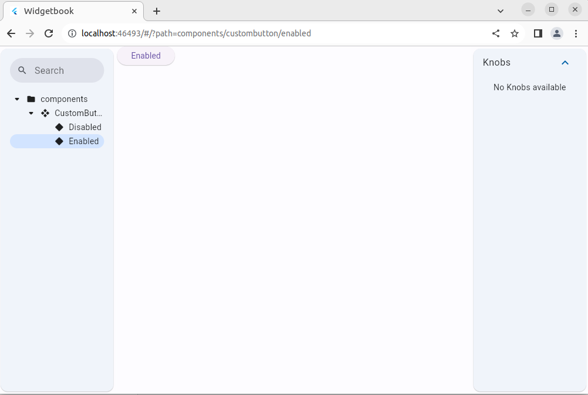

# test_widgetbook

Widgetbook example.

This implementation allows developers to preview their widgets in a catalog-like structure, promoting easy accessibility and reusability of components.

# PREREQUISITS:

## FLUTTER INSTALLATION

## Getting Started (https://docs.flutter.dev/get-started/install/windows/desktop)

 1) install fluter extension  https://marketplace.visualstudio.com/items?itemName=Dart-Code.flutter
 2) Launch VS Code.

    To open the Command Palette, press Control + Shift + P.

    In the Command Palette, type flutter.

    Select Flutter: New Project.

    VS Code prompts you to locate the Flutter SDK on your computer.

        If you have the Flutter SDK installed, click Locate SDK.

        If you do not have the Flutter SDK installed, click Download SDK.

        This option sends you the Flutter install page if you have not installed Git for Windows as directed in the development tools prerequisites.

    When prompted Which Flutter template?, ignore it. Press Esc. You can create a test project after checking your development setup.

# WIDGETBOOK SETUP

- cd to test_widgetbook
- to run code generator : 
´´´flutter pub run build_runner build --delete-conflicting-outputs´´´
- To run the Widgetbook app: 
´´´flutter run -d chrome -t lib/main.dart´´´

**Remember** that you can create a Widgetbook entry point in your existing app or create a new independent one.

Directories are a list of folders, components, and use cases. Generator creates the directories variable automatically.

// single app
flutter_app
└─── lib
| └─── feature.dart
│ └─── main.dart
│ └─── main.widgetbook.dart
└─── pubspec.yaml

// separate app
flutter_app
└─── feature_1
└─── app
|    └───lib
|    |    └─── main.dart
|    └─── pubspec.yaml
└─── widgetbook_app
|    └─── lib
|    |    └─── main.widgetbook.dart
|    └─── pubspec.yaml

## Docs: 
- https://docs.widgetbook.io/
- https://www.widgetbook.io/blog/getting-started